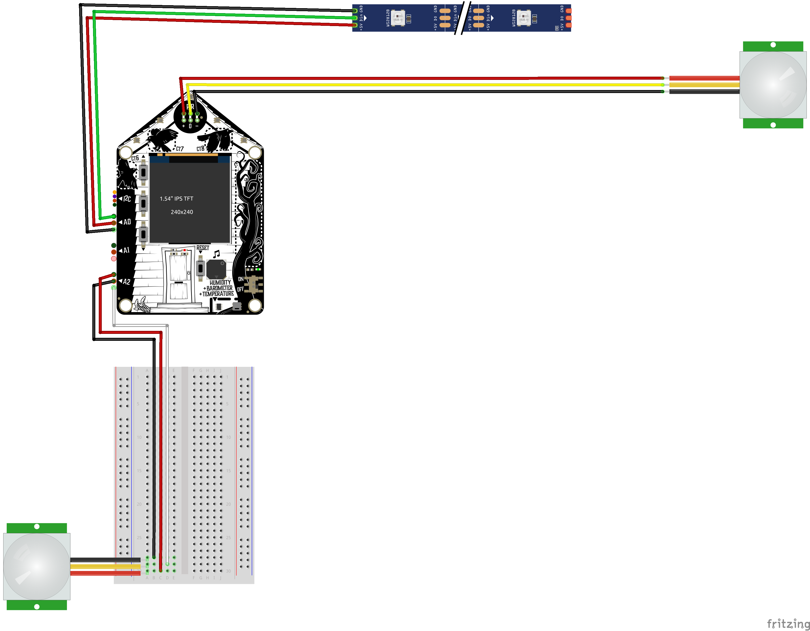
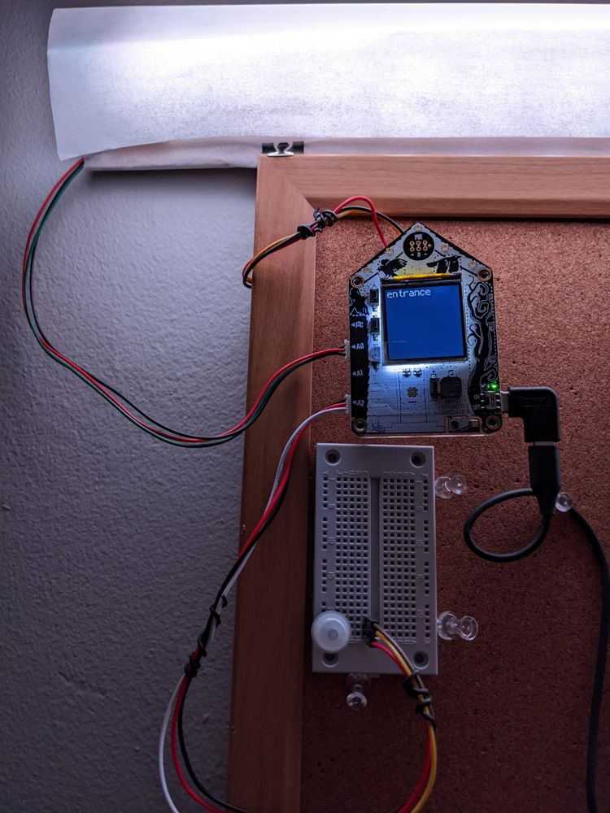

# Hallway Sensor Lights
## using [Funhouse](https://www.adafruit.com/product/4985) by [Adafruit](https://www.adafruit.com/)

Using the Funhouse automation development board, I programmed it to help illuminate a dark hallway which is triggered via 2 Proximity Infra-Red sensors.

The LED strip is taped to a piece of cardboard. It is also wrapped in parchment paper found in the grocery store to defuse the LED light.

## Screenshots

## Required Libraries
- `adafruit_bitmap_font/`
- `adafruit_display_text/`
- `adafruit_funhouse/`
- `adafruit_io/`
- `adafruit_minimqtt/`
- `adafruit_register/`
- `adafruit_ahtx0.mpy`
- `adafruit_dotstar.mpy`
- `adafruit_dps310.mpy`
- `adafruit_fakerequests.mpy`
- `neopixel.mpy`
- `simpleio.mpy`